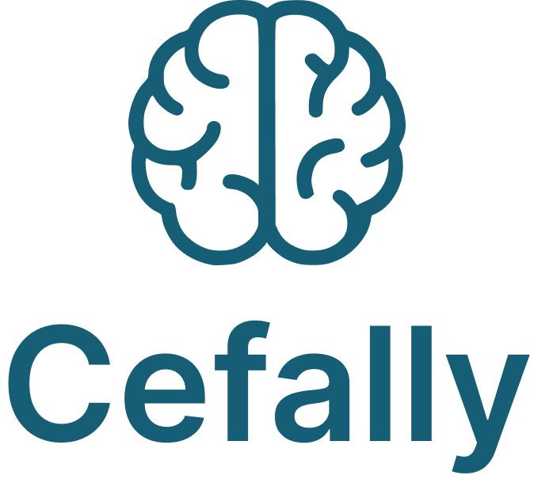

<div align="center">
    

  <p align="center">
    Um aplicativo móvel para registrar, acompanhar e analisar episódios de cefaleia.
  </p>
</div>

### Sumário
1. [Funcionalidades do MVP](#funcionalidades-básicas-para-um-mvp)
1. [Funcionalidades Futuras](#funcionalidades-adicionais-para-checkpoints-futuros)
1. [Protótipos](#protótipos)
1. [Modelagem do Banco](#modelagem-do-banco)
1. [Planejamento](#planejamento)
1. [Tecnologias Utilizadas](#tecnologias-utilizadas)

Este aplicativo foi pensado para ser uma ferramenta de apoio para pessoas que sofrem com enxaquecas ou dores de cabeça no geral. A motivação para o desenvolvimento surgiu da minha própria experiência com **cefaleia em salvas**, um tipo de dor bem intensa e debilitante que ocorre em episódios regulares [(Manual MSD)](https://www.msdmanuals.com/pt/casa/dist%C3%BArbios-cerebrais-da-medula-espinal-e-dos-nervos/cefaleias/cefaleias-em-salvas).

Ao longo do tempo, percebi como é importante manter registro dos episódios — seus gatilhos, intensidade, sintomas e efeitos dos medicamentos — para ajudar tanto no acompanhamento pessoal quanto no suporte ao diagnóstico médico.

### Funcionalidades básicas para um MVP

- [ ] Registrar episódios com:
  - [x] Data
  - [x] Intensidade da dor (ex: escala de 1 a 10)
  - [x] Local da dor na região do crânio
  - [x] Sintomas associados
  - [x] Possíveis gatilhos (ex: alimentação, estresse, sono, etc.)
  - [x] Medicamentos utilizados
  - [x] Resultado do medicamento (a dor passou ou não)
- [x] Visualizar histórico dos episódios
- [ ] Editar ou excluir registros
- [x] Armazenamento local dos dados [(Zustand)](https://zustand.docs.pmnd.rs/getting-started/introduction)
- [ ] Modo escuro

### Funcionalidades adicionais (para checkpoints futuros)

- [ ] Gráficos de frequência e intensidade das crises
- [ ] Notificações para lembrar de registrar crises ou tomar medicamentos
- [ ] Quantidade de dias desde a última ocorrência
- [ ] Exportar histórico em PDF ou CSV

### Protótipos
Os protótipos podem ser acessos neste link:
https://www.figma.com/design/U5ZSicMuBaHga42wSojIEv/Cefally

### Modelagem do banco
```
├── 🗂️ Collection: users
│   └── 📄 Document: {userId}
│       ├── name: string
│       ├── email: string
│       └── createdAt: timestamp
│
├── 🗂️ Collection: episodes
│   └── 📄 Document: {episodeId}
│       ├── userId: string (ref → users/{userId})
│       ├── timestamp: number
│       ├── dayPeriod: string (ex: "manhã", "tarde", "noite")
│       ├── intensity: number (1–10)
│       ├── painLocation: arrat<string> (ex: ["frente", "lateral"])
│       ├── symptoms: array<string> (ex: ["náusea", "fotofobia"])
│       ├── triggers: array<string> (ex: ["estresse", "falta de sono"])
│       ├── medication: string
│       ├── medicationOutcome: string (ex: "a dor passou")
│       └── notes: string
```

### Planejamento

Sprint 1 – Planejamento e Infraestrutura (Semana 1)

**Objetivo:** Estabelecer as bases do projeto e definir o escopo mínimo viável.

- ~~Definição dos requisitos do MVP~~
- ~~Escolha e documentação do Design System (cores, tipografia, componentes)~~
- ~~Criação do repositório no GitHub e organização da estrutura inicial~~
- ~~Configuração do ambiente com **Expo + React Native**~~

---

Sprint 2 – Autenticação e Navegação (Semana 2)

**Objetivo:** Implementar o fluxo de login/registro e a estrutura de navegação.

- ~~Tela de Boas-Vindas~~
- ~~Telas de Login e Registro com Firebase Authentication~~
- ~~Navegação com React Navigation (Stack e Bottom Tabs)~~
- ~~Proteção para rotas privadas~~

---

Sprint 3 – Registro de Episódio (Semana 3)

**Objetivo:** Desenvolver o formulário de registro de crises de enxaqueca.

- ~~Tela de "Novo Episódio"~~
- ~~Campos: data/hora, intensidade, localização da dor, período do dia, sintomas, gatilhos, medicação, resultado da medicação, observações~~
- ~~Validação e usabilidade dos campos~~
- ~~Salvamento dos dados no Firestore, com referência ao `userId`~~

---

Sprint 4 – Dashboard e Histórico (Semana 4)

**Objetivo:** Exibir informações registradas pelo usuário.

- Tela Home / Dashboard:
  - Resumo do último episódio
  - Atalhos para registrar novo episódio
- ~~Tela de Histórico de Episódios:~~
  - ~~Listagem dos episódios com informações resumidas~~
- ~~Leitura dos dados armazenados no Firestore~~

---

Sprint 5 – Edição e Histórico de Alterações (Semana 5)

**Objetivo:** Permitir que o usuário visualize, edite e acompanhe modificações nos registros.

- Tela de detalhes de um episódio
- Edição dos dados registrados
- Criação/atualização de documentos na coleção `history` com cada alteração
- Registro da data e descrição da modificação

---

Sprint 6 – Refinamento, Testes e Apresentação (Semana 6)

**Objetivo:** Finalizar o MVP com estabilidade, testes e ajustes de experiência do usuário.

- Melhorias visuais conforme Design System
- Testes de usabilidade e correções de bugs
- Revisão de fluxo de navegação
- Ajustes de performance e responsividade
- Preparação para demonstração/apresentação final do app


## Tecnologias utilizadas

- React Native (Expo)
- TypeScript

## Atualizações desde o último checkpoint
### Recursos dos módulos anteriores
- Usei [Zustand](https://zustand.docs.pmnd.rs/getting-started/introduction) para gerenciar o estado global do aplicativo, facilitando o armazenamento e recuperação de dados do usuário.
- Utilizei [NativeWind](https://nativewind.dev/) para estilização de todas as telas do aplicativo.
- Implementei o [Firebase Authentication](https://firebase.google.com/docs/auth) para gerenciar o login e registro de usuários.
- Usei [Firebase Firestore](https://firebase.google.com/docs/firestore) para armazenar os dados dos episódios de cefaleia, permitindo consultas eficientes e escalabilidade.
- Adicionei Roteamento avançado com [React Navigation](https://reactnavigation.org/docs/getting-started) para gerenciar a navegação entre telas, incluindo pilhas e abas.


### Conceitos da aula "Boas práticas para a criação de componentes reutilizáveis"
1. **Isolamento de componentes que se repetem**
    - Criação do componente SelectionButton que é usado em vários lugares para seleção de sintomas, gatilhos e local da dor
    - O componente DateSelector também foi isolado para reuso em outros contextos
2. **Uso de nomenclaturas minimalistas**
    - Nomes claros e diretos como SelectionButton, DateSelector, DayPeriodSelector
    - Props com nomes intuitivos como isSelected, onPress, label
3. **Parametrização de componentes**
    - SelectionButton recebe props para customizar seu comportamento (label, isSelected, onPress)
    - DateSelector parametriza a data e o callback de mudança
    - DayPeriodSelector parametriza os períodos disponíveis e o período selecionado
4. **Criando componentes que disparam eventos para o pai**
    - DateSelector dispara eventos de mudança de data para o componente pai
    - SelectionButton notifica o pai sobre seleções
    - DayPeriodSelector comunica mudanças de período

## Troubleshooting
On Expo SDK 53, if you see "Warning: Error: Component auth has not been registered yet", follow this solution: https://stackoverflow.com/a/79636536 

Retirado do repositório: [simple-firestore-hooks](https://github.com/andresjesse/simple-firestore-hooks/commit/4af99cfb262b78506d46a6e6d7b979777f8c006a#diff-1550ec65ac92f65817fc28928dfef526912b5f52356ff43651369bae92f56031R158-R159)